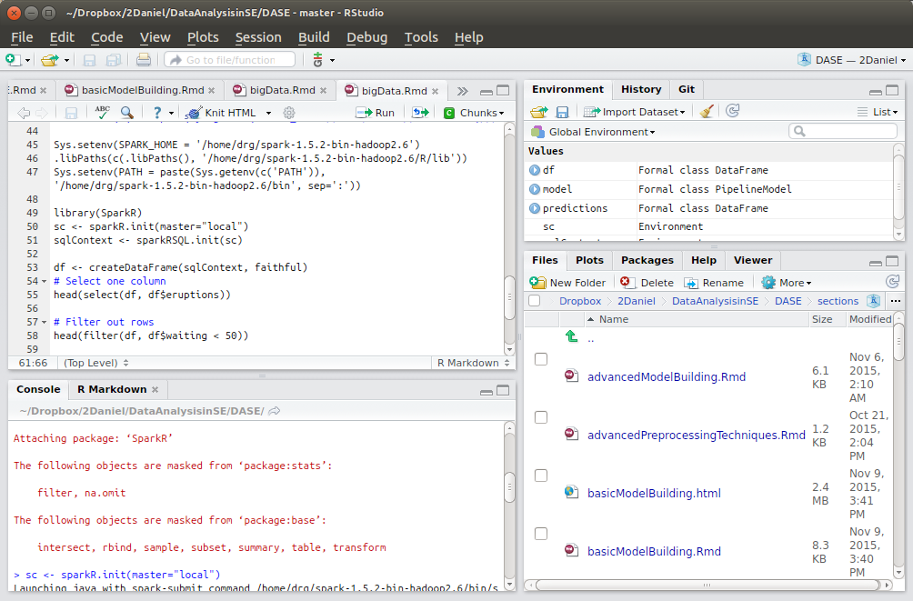
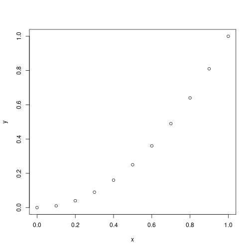
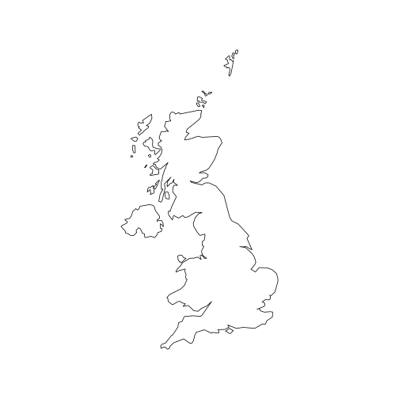
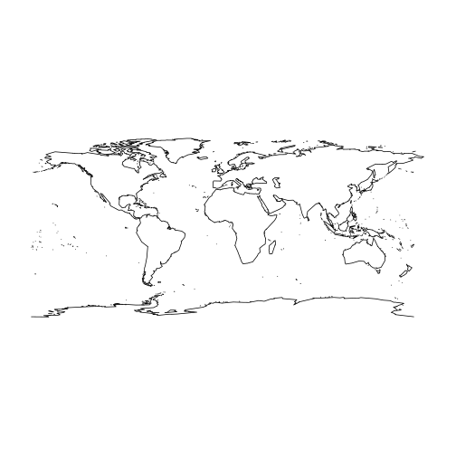
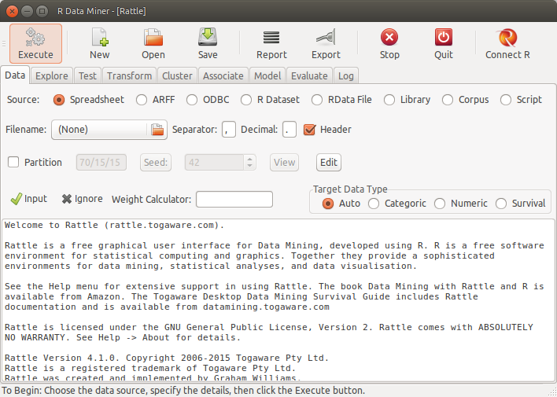

R Tutorial
========================================================
author: Kristiana University College
date: Oct 2021
autosize: true

Master Big Data


What is R
========================================================

+ Dialect of S-language

+ 20 years old (Bell Labs, turning ideas quickly and faithfully)

+ Language + Environment for statistical computing, package based

[CRAN Task Views]: (https://cran.r-project.org/web/views/)

+ Object-Oriented language

+ Free! (open source)


Getting started
========================================================

+ Easy installation

+ Workspace:

 - `.Rdata`

+ History:

  - `Rprofile.site`

  - `.Rhistory`

+ Layout:

  - Console

  - RStudio (later)

Getting started
========================================================

-   R is a programming language for statistical computing and data analysis that supports a variety of programming styles. See [R in Wikipedia](https://en.wikipedia.org/wiki/R_(programming_language))

-   R has multiple online resources and books. 

-   [R coding style](https://google.github.io/styleguide/Rguide.xml)

-   [R-Bloggers](https://www.r-bloggers.com/)

- Repositories
    - [CRAN](https://cran.r-project.org/)
    - [Bioconductor](https://www.bioconductor.org/)
    - Etc

Getting help in R
========================================================

-   [RStudio cheat sheet](https://github.com/rstudio/cheatsheets/raw/master/rstudio-ide.pdf)
-   [Base R cheat sheet](http://github.com/rstudio/cheatsheets/raw/master/base-r.pdf)
-   [Advanced R cheat sheet](https://www.rstudio.com/wp-content/uploads/2016/02/advancedR.pdf)
-   [Data Visualization cheat sheet](https://github.com/rstudio/cheatsheets/raw/master/data-visualization-2.1.pdf)
-   [R Markdown cheatsheet](https://github.com/rstudio/cheatsheets/raw/master/rmarkdown-2.0.pdf)
-   [R Markdown Basics] (<http://rmarkdown.rstudio.com/authoring_basics.html>)
-   [Python with R and Reticulate Cheatsheet](https://github.com/rstudio/cheatsheets/raw/master/reticulate.pdf)
-   [Caret](https://github.com/rstudio/cheatsheets/raw/master/caret.pdf) (More later)
-   [All cheatsheets and translations](https://rstudio.com/resources/cheatsheets/)
-   Bookdown [bookdown.org](bookdown.org)


R commands
========================================================
+ Case sensitive

+ Expression or Assignment

+ Comments starting with `#`

+ Quit command: `q()` or `quit()`


Help
========================================================

+ `help(...)`

+ `help.search(...)`

+ `apropos(...)`

+ `example(...)`


Working directory
========================================================

Working directory can be accessed and set through:

+ `getwd()`

+ `setwd(...)`


R session
========================================================
Start R in your working directory
  + Rprofile.site, .Rhistory, .RData
  
Use R:
  + Instantiate objects/variables
  + Make computation
  + Visualization
  
Quit
 + Save workspace
 + Rprofile.site, .Rhistory, .Rdata


Exercise 1. Install R and RStudio (10 min)
========================================================

1. Install R:

  a. R website: https://cran.r-project.org/
  
  b. R download (many mirrors): http://cran.uib.no/
  
2. Install RStudio:

  a. RStudio website: http://www.rstudio.com/

  b. Choose the Desktop version.


Rstudio
========================================================



Part 2. Basic R.
========================================================

Basic R - Operators
========================================================
Operations
+ addition: +
+ subtraction: -
+ multiplication: *
+ division: /, integer division: %/% 
+ exponentiation: ^
+ modulus operator: %%


Basic operations
========================================================

```r
1+1 # Addition
```

```
[1] 2
```


```r
4 - 3 # Subtraction
```

```
[1] 1
```


```r
4 * 2 + 1 # Operator precedence
```

```
[1] 9
```


```r
6 ^ 2 # Exponentiation
```

```
[1] 36
```


```r
sqrt(25) # Math function
```

```
[1] 5
```


Basic Data Types
========================================================

-   `class( )`

-   logical: `TRUE`, `T`, `FALSE`, `F`

-   numeric, integer:

    -   `is.numeric()`
    -   `is.integer()`

-   `character`


Basic Data Types - Examples
========================================================

- TRUE or T, FALSE or F


```r
TRUE
```

```
[1] TRUE
```

```r
class(TRUE)
```

```
[1] "logical"
```

```r
FALSE
```

```
[1] FALSE
```

```r
F
```

```
[1] FALSE
```


Basic Data Types - Examples
========================================================
-   `NA` stands for Not Available, which is not a number as well. It applies to missing values.
-   `NaN` means 'Not a Number'


```r
NA
```

```
[1] NA
```

```r
class(NA)
```

```
[1] "logical"
```

```r
NaN
```

```
[1] NaN
```

```r
class(NaN)
```

```
[1] "numeric"
```

Basic Data Types - Examples 
========================================================

```r
T
```

```
[1] TRUE
```

```r
F
```

```
[1] FALSE
```

```r
NaN
```

```
[1] NaN
```

```r
class(NaN)
```

```
[1] "numeric"
```

Basic Data Types - Examples
========================================================

```r
# numeric data type
2
```

```
[1] 2
```

```r
class(2)
```

```
[1] "numeric"
```

```r
2.5
```

```
[1] 2.5
```

```r
2L  # integer
```

```
[1] 2
```

```r
class(2L)
```

```
[1] "integer"
```

========================================================

```r
is.numeric(2)
```

```
[1] TRUE
```

```r
is.numeric(2L)
```

```
[1] TRUE
```

```r
is.integer(2)
```

```
[1] FALSE
```

```r
is.integer(2L)
```

```
[1] TRUE
```

```r
is.numeric(NaN)
```

```
[1] TRUE
```

Basic R - Objects
========================================================
Objects


```r
ls()
```


```r
objects()
```


Basic R - Vectors
========================================================
Vectors, sequence of ordered numbers
  

```r
x <- c(23,22,10,5.4,22.1)
x
```

```
[1] 23.0 22.0 10.0  5.4 22.1
```

```r
x = c(23,22,10,5.4,22.1)
x
```

```
[1] 23.0 22.0 10.0  5.4 22.1
```

```r
c(23,22,10,5.4,22.1) -> x
x
```

```
[1] 23.0 22.0 10.0  5.4 22.1
```

```r
assign("x",c(23,22,10,5.4,22.1))# <- is equivalent to 'assign()'
x
```

```
[1] 23.0 22.0 10.0  5.4 22.1
```

Basic R - Vectors
========================================================


```r
phases <- c("reqs", "dev", "test1", "test2", "maint")
str(phases[2])
```

```
 chr "dev"
```

```r
is.vector(phases)
```

```
[1] TRUE
```

```r
length(phases)
```

```
[1] 5
```

========================================================

```r
thevalues <- c(15, 60, 30, 35, 22)
names(thevalues) <- phases
str(thevalues)
```

```
 Named num [1:5] 15 60 30 35 22
 - attr(*, "names")= chr [1:5] "reqs" "dev" "test1" "test2" ...
```

```r
thevalues
```

```
 reqs   dev test1 test2 maint 
   15    60    30    35    22 
```

Basic R - Vectors
========================================================


```r
x <- c(3,4,1)
x <- x + 4
x
```

```
[1] 7 8 5
```

```r
y = c(10,11)
z = x + y
```


What about z?


```r
z
```

```
[1] 17 19 15
```

Basic R - Vectors
========================================================

A single value is a vector! Example:


```r
aphase <- 44
is.vector(aphase)
```

```
[1] TRUE
```

```r
length(aphase)
```

```
[1] 1
```


Basic R - Coercion for vectors
========================================================


```r
thevalues1 <- c(15, 60, "30", 35, 22)
class(thevalues1)
```

```
[1] "character"
```

```r
thevalues1
```

```
[1] "15" "60" "30" "35" "22"
```

Basic R - Arithmetic
========================================================

Other functions:

`sqrt`, `log`, `exp`, `sin`, `cos`, `tan`, `min`, `max`,
`length`, `sum`, `mean`, `var`, ...


```r
NA + 1
```

```
[1] NA
```

```r
mean(c(5,NA,7))
```

```
[1] NA
```

```r
# some functions allow to remove NAs
mean(c(5,NA,7), na.rm=TRUE)  
```

```
[1] 6
```


Basic R - Sequences
========================================================


```r
1:10
```

```
 [1]  1  2  3  4  5  6  7  8  9 10
```

```r
10:1
```

```
 [1] 10  9  8  7  6  5  4  3  2  1
```

```r
seq(from = 1, to = 10)
```

```
 [1]  1  2  3  4  5  6  7  8  9 10
```

```r
seq(from = 10, to = 1)
```

```
 [1] 10  9  8  7  6  5  4  3  2  1
```

```r
seq(from = 1, length = 10, by =4)
```

```
 [1]  1  5  9 13 17 21 25 29 33 37
```

========================================================

```r
seq(0,1,.1)
```

```
 [1] 0.0 0.1 0.2 0.3 0.4 0.5 0.6 0.7 0.8 0.9 1.0
```

Basic R - Logical vectors
========================================================


```r
x = seq(from=1, to=10)
x
```

```
 [1]  1  2  3  4  5  6  7  8  9 10
```

```r
y = (x %% 3 == 0)
y
```

```
 [1] FALSE FALSE  TRUE FALSE FALSE  TRUE FALSE FALSE  TRUE FALSE
```

Basic R - Index vectors
========================================================
Index vectors
  + accessed by index
  + from 1
  + logical condition


```r
x = c(2,5,7,9)
x[1]
```

```
[1] 2
```

```r
x[c(2,4)]
```

```
[1] 5 9
```

```r
x[x<7]
```

```
[1] 2 5
```


Basic R - Matrices
========================================================

A matrix: is a two-dimensional object
  + created using the “matrix” function
  

```r
matrixA = matrix(data = c(1:10), ncol = 2, nrow = 5)
matrixA
```

```
     [,1] [,2]
[1,]    1    6
[2,]    2    7
[3,]    3    8
[4,]    4    9
[5,]    5   10
```


Basic R - Arrays
========================================================

An array is a __n-dimensional__ object, 
  + created using the “array” and dim functions
  

```r
x = c(1:18)
x
```

```
 [1]  1  2  3  4  5  6  7  8  9 10 11 12 13 14 15 16 17 18
```
  


```r
y = array(data=x, dim=c(2,3,2))
y
```

```
, , 1

     [,1] [,2] [,3]
[1,]    1    3    5
[2,]    2    4    6

, , 2

     [,1] [,2] [,3]
[1,]    7    9   11
[2,]    8   10   12
```

Basic R - Arrays and matrices: accessing by index
========================================================


```r
x <- array(data=c(1:12), dim=c(3,4)) #generate 3 by 4 matrix
x
```

```
     [,1] [,2] [,3] [,4]
[1,]    1    4    7   10
[2,]    2    5    8   11
[3,]    3    6    9   12
```


```r
i <- array(c(1:3,3:1), dim=c(3,2))
i
```

```
     [,1] [,2]
[1,]    1    3
[2,]    2    2
[3,]    3    1
```

========================================================


```r
x[i] <- -1
x
```

```
     [,1] [,2] [,3] [,4]
[1,]    1    4   -1   10
[2,]    2   -1    8   11
[3,]   -1    6    9   12
```


Basic R - Lists
========================================================

  + a collection of objects (components)
  + components can be of different types
  + each element in a list can be a:
    - vector
    - matrix
    - array
    - dataframe
    - list


Basic R - Lists
========================================================


```r
lst = list(name="Erna", surname="Solberg", age=52, birthplace="Bergen")
lst$name
```

```
[1] "Erna"
```

```r
lst[1]
```

```
$name
[1] "Erna"
```

```r
length(lst)
```

```
[1] 4
```

  
Exercise 2 2. Basic R (15 min)
========================================================

Exercise

  1. Calculate average of vector without using mean function.
  2. Compare the result with the value obtained by using the function `mean()`
  3. Compare the results with both variants
  
  
  
Exercise 3 3. Basic R (15 min)
========================================================

Exercise

  1. Create a vector with only odd numbers from 1 to 100
  2. Create a vector`[1,2,3,...,100]`.  Remove non-even numbers.
  3. Compare the two resulting vectors.  
  


Exercise 3 4. Basic R (15 min)
========================================================

Exercise

  1. Create a vector containing numbers from 1 to 100
  2. Change every fourth element to 0 
      - (elements that can be divided into 4).

Example output:
> x

> `[1] 1 2 3 0 5 6 7 0 9 10 11 0...`


Basic R - DataFrame
========================================================
DataFrame is a matrix with certain restrictions:
    + each column contains a vector
    + first row named header
  - used for storing/reading data from tables


```r
prices = c(3.0, 4.5, 5.1, 3.7)
squaremeters = c(80, 120, 110, 90)
cities = c("Trondheim", "Trondheim", "Oslo", "Bergen")
data.frame(cities, squaremeters, prices)
```

```
     cities squaremeters prices
1 Trondheim           80    3.0
2 Trondheim          120    4.5
3      Oslo          110    5.1
4    Bergen           90    3.7
```


Basic R - DataFrame
========================================================

Accessing a DataFrame as a normal matrix


```r
apartmentPrices = data.frame(cities, squaremeters, prices)
apartmentPrices[3,]
```

```
  cities squaremeters prices
3   Oslo          110    5.1
```

```r
apartmentPrices$prices
```

```
[1] 3.0 4.5 5.1 3.7
```


Basic R - DataFrame
========================================================

Accessing part of DataFrame


```r
head(apartmentPrices, n=2)
```

```
     cities squaremeters prices
1 Trondheim           80    3.0
2 Trondheim          120    4.5
```


Flow of Control
========================================================

`Ifelse`


```r
library(foreign)
kc1 <- read.arff("datasets/KC1.arff")
head(kc1$Defective, 1)
kc1$Defective <- ifelse(kc1$Defective == "Y", 1, 0)
head(kc1$Defective, 1)
```


Basic R - I/O
========================================================

Reading data from a table
  - external files
  - using: `read.table()` function

format:
  - 1st line: column names
  - N-th line: row label + value for each variable
  

Basic R - Reading data from a table
========================================================


```r
table <- read.table("housing_prices.dat", header=TRUE, sep = ",")
table
```

```
     cities squaremeters prices
1 Trondheim           80    3.0
2 Trondheim          120    4.5
3      Oslo          110    5.1
4    Bergen           90    3.7
```


Basic R - Reading ARFF files
========================================================

`foreing` library


```r
library(foreign)
isbsg <- read.arff("datasets/isbsg10teaser.arff")

mydataISBSG <- isbsg[, c("FS", "N_effort")]

str(mydataISBSG)
```

```
'data.frame':	37 obs. of  2 variables:
 $ FS      : num  225 599 333 748 158 427 461 257 115 116 ...
 $ N_effort: num  1856 10960 5661 1518 3670 ...
```


Basic R - Functions
========================================================

Functions

  - general structure


```r
myfun <- function(arg1, arg2, ... ){
# statements
return(object)
}
```


Basic R `source()`
========================================================

Functions

  - storing to a file/reading from a file: `source()` function
    + create functions
    + save to a file
    + use it by (`source<filename>`)
  
  
Basic R - Graphics
========================================================

  - Useful for data exploration
  - R provides many packages/functions available
  - `plot()` function


```r
x <- seq(0,1,0.1)
y <- x^2
plot(x,y)
```



Basic R - Graphics
========================================================

Saving graphs to a file:


```r
png("cos.png")
plot(cos,-2*pi,2*pi)
dev.off()
```

```
png 
  2 
```

Check your working directory!  


Visualisation - Example maps
========================================================

Visualising maps

  - CRAN URL: http://cran.r-project.org/web/packages/maps/
  - creating maps of countries and regions of the world
  - latitude and longitude
  - low resolution maps

Basic usage:


```r
library(maps)
map(database="world",region="uk")
```



Visualisation - Example maps
========================================================

Visualize world map without inner boundaries
  

```r
map(database = "world",interior = FALSE)
```



Visualisation - Example maps
========================================================

Visualising maps

  - mapdata: http://cran.r-project.org/web/packages/mapdata
  - a map database with higher resolution
  - visualising map of Japan with interior line in gray
  


```r
library(mapdata)
map(database="japan")
map(database="japan",boundary=FALSE,interior=TRUE,col="gray",add=TRUE)
```


Visualisation - Example maps
========================================================

Visualising maps

  + ggmap: http://cran.r-project.org/web/packages/ggmap
  + Google Maps, OpenStreetMap, Stamen Maps
  
  

```r
library(ggmap)
geocode("Oslo, Norway")
map_of_oslo <- get_googlemap(center=c(10.8,59.9), zoom=12)
ggmap(map_of_oslo)
```


Data analysis - Datasets
========================================================

R comes with some built-in datasets ready to use
[Description of datasets](http://www.sthda.com/english/wiki/r-built-in-data-sets)


```r
data()  #list of datasets already available
# load the mtcars  Motor Trend Car Road Tests
data("mtcars")

# Monthly Airline Passenger Numbers 1949-1960
# Time series object ts() convert a vector to a time series
data("AirPassengers")
str(AirPassengers)
plot(AirPassengers)

#Etc.
```

Data analysis in R with Rattle
========================================================




