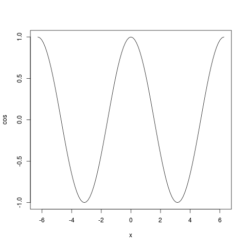
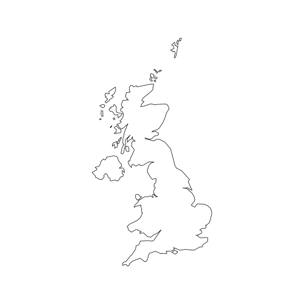
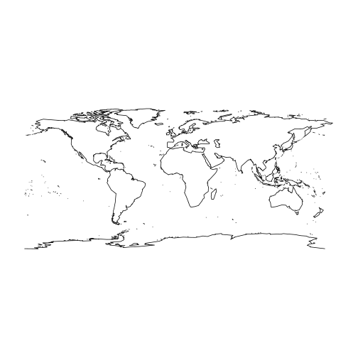
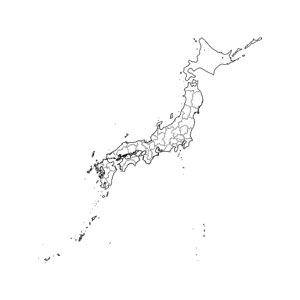

RTutorial
========================================================
author: Kristiana University College
date: Oct 2020
autosize: true


What is R
========================================================

+ Dialect of S-language

+ 20 years old (Bell Labs, turning ideas quickly and faithfully)

+ Language + Environment for statistical computing, package based

[CRAN Task Views]: (https://cran.r-project.org/web/views/)

+ Object-Oriented language

+ Free! (open source)


Getting started
========================================================

+ Easy installation

+ Workspace:

 - .Rdata

+ History:

  - Rprofile.site

  - .Rhistory

+ Layout:

  - Console

  - RStudio


R commands
========================================================
+ Case sensitive

+ Expression or Assignment

+ Comments starting with `#`

+ Quit command: `q()`


Help
========================================================

+ `help(...)`

+ `help.search(...)`

+ `apropos(...)`

+ `example(...)`


Working directory
========================================================

+ `getwd()`

+ ´setwd(...)`


R session
========================================================
Start R in your working directory
  + Rprofile.site, .Rhistory, .RData
Use R:
  + Instantiate objects/variables
  + Make computation
  + Visualization
Quit
 + Save workspace
 + Rprofile.site, .Rhistory, .Rdata


Exercise 1. Install R and RStudio (10 min)
========================================================

1. Install R:
  a. R website:
  
  
  b. R download: http://cran.uib.no/
  
2. Install RStudio:

a. RStudio website: http://www.rstudio.com/

b. Choose the Desktop version.


Part 2. Basic R.
========================================================

Basic R
========================================================
Operations
+ addition: +
+ subtraction: -
+ multiplication: *
+ division: /
+ exponentiation: ^
+ modulo: %%


Basic operations
========================================================

```r
1+1 # Addition
```

```
[1] 2
```


```r
4 - 3 # Subtraction
```

```
[1] 1
```


```r
4 * 2 + 1 # Operator precedence
```

```
[1] 9
```


```r
6 ^ 2 # Exponentiation
```

```
[1] 36
```


```r
sqrt(25) # Math function
```

```
[1] 5
```


Basic R
========================================================
Objects


```r
ls()
```


```r
objects()
```


Basic R
========================================================
Vectors
  + Sequence of ordered numbers
  

```r
x <- c(23,22,10,5.4,22.1)
x
```

```
[1] 23.0 22.0 10.0  5.4 22.1
```

```r
x = c(23,22,10,5.4,22.1)
x
```

```
[1] 23.0 22.0 10.0  5.4 22.1
```

```r
c(23,22,10,5.4,22.1) -> x
x
```

```
[1] 23.0 22.0 10.0  5.4 22.1
```

```r
x = assign("x",c(23,22,10,5.4,22.1))
x
```

```
[1] 23.0 22.0 10.0  5.4 22.1
```


Basic R
========================================================
Vectors and length


```r
x <- c(3,4,1)
x <- x + 4

x
```

```
[1] 7 8 5
```

```r
y = c(10,11)
z = x + y
```


What about z?


```r
z
```

```
[1] 17 19 15
```


Basic R
========================================================

+ Arithmetic

+, *, -, /, ^

sqrt, log, exp, sin, cos, tan, min, max,
length, sum, mean, var


Basic R
========================================================
Sequences


```r
1:10
```

```
 [1]  1  2  3  4  5  6  7  8  9 10
```

```r
10:1
```

```
 [1] 10  9  8  7  6  5  4  3  2  1
```

```r
seq(from = 1, to = 10)
```

```
 [1]  1  2  3  4  5  6  7  8  9 10
```

```r
seq(from = 10, to = 1)
```

```
 [1] 10  9  8  7  6  5  4  3  2  1
```

```r
seq(from = 1, length = 10, by =4)
```

```
 [1]  1  5  9 13 17 21 25 29 33 37
```


Basic R
========================================================
Logical vectors


```r
x = seq(from=1, to=10)
x
```

```
 [1]  1  2  3  4  5  6  7  8  9 10
```

```r
y = (x %% 3 == 0)
y
```

```
 [1] FALSE FALSE  TRUE FALSE FALSE  TRUE FALSE FALSE  TRUE FALSE
```

Basic R
========================================================
Index vectors
  + accessed by index
  + from 1
  + logical condition


```r
x = c(2,5,7,9)
x[1]
```

```
[1] 2
```

```r
x[c(2,4)]
```

```
[1] 5 9
```

```r
x[x<7]
```

```
[1] 2 5
```


Basic R
========================================================

Matrices
  + a matrix: is a two-dimensional object
  + created using the “matrix” function
  

```r
matrixA = matrix(data = c(1:10), ncol = 2, nrow = 5)
matrixA
```

```
     [,1] [,2]
[1,]    1    6
[2,]    2    7
[3,]    3    8
[4,]    4    9
[5,]    5   10
```


Basic R
========================================================
Arrays
  + an array: is a __n-dimensional__ object, 
  + created using the “array” and dim functions
  

```r
x = c(1:18)
x
```

```
 [1]  1  2  3  4  5  6  7  8  9 10 11 12 13 14 15 16 17 18
```
  


```r
y = array(data=x, dim=c(2,3,2))
y
```

```
, , 1

     [,1] [,2] [,3]
[1,]    1    3    5
[2,]    2    4    6

, , 2

     [,1] [,2] [,3]
[1,]    7    9   11
[2,]    8   10   12
```

Basic R
========================================================
Arrays and matrices: accessing by index


```r
x <- array(data=c(1:12), dim=c(3,4)) #generate 3 by 4 matrix
x
```

```
     [,1] [,2] [,3] [,4]
[1,]    1    4    7   10
[2,]    2    5    8   11
[3,]    3    6    9   12
```


```r
i <- array(c(1:3,3:1), dim=c(3,2))
i
```

```
     [,1] [,2]
[1,]    1    3
[2,]    2    2
[3,]    3    1
```


```r
x[i] <- -1
x
```

```
     [,1] [,2] [,3] [,4]
[1,]    1    4   -1   10
[2,]    2   -1    8   11
[3,]   -1    6    9   12
```


Basic R
========================================================
Lists
  + a collection of objects (components)
  + components can be of different types
  + each element in a list can be a:
    - vector
    - matrix
    - array
    - dataframe
    - list
  
  
Exercise 2 2. Basic R (15 min)
========================================================

Exercise

  1. Calculate average of vector without using mean function.
  2. Compare the result with the value obtained by using the function `mean()`
  3. Compare the results with both variants
  
  
  
Exercise 3 3. Basic R (15 min)
========================================================

Exercise

  1. Create a vector with only odd numbers from 1 to 100
  2. Create a vector`[1,2,3,...,100]`.  Remove non-even numbers.
  3. Compare the two resulting vectors.  
  


Exercise 3 4. Basic R (15 min)
========================================================

Exercise

  1. Create a vector containing numbers from 1 to 100
  2. Change every fourth element to 0 
      - (elements that can be divided into 4).

Example output:
> x

> `[1] 1 2 3 0 5 6 7 0 9 10 11 0...`3


Basic R
========================================================

Lists


```r
lst = list(name="Erna", surname="Solberg", age=52, birthplace="Bergen")
lst$name
```

```
[1] "Erna"
```

```r
lst[1]
```

```
$name
[1] "Erna"
```

```r
length(lst)
```

```
[1] 4
```


Basic R
========================================================
DataFrame
  - a matrix with certain restrictions
    + each column contains a vector
    + first row named header
  - used for storing/reading data from tables


```r
prices = c(3.0, 4.5, 5.1, 3.7)
squaremeters = c(80, 120, 110, 90)
cities = c("Trondheim", "Trondheim", "Oslo", "Bergen")
data.frame(cities, squaremeters, prices)
```

```
     cities squaremeters prices
1 Trondheim           80    3.0
2 Trondheim          120    4.5
3      Oslo          110    5.1
4    Bergen           90    3.7
```


Basic R
========================================================

Accessing a DataFrame as a normal matrix


```r
apartmentPrices = data.frame(cities, squaremeters, prices)
apartmentPrices[3,]
```

```
  cities squaremeters prices
3   Oslo          110    5.1
```

```r
apartmentPrices$prices
```

```
[1] 3.0 4.5 5.1 3.7
```


Basic R
========================================================

Accessing part of DataFrame


```r
head(apartmentPrices, n=2)
```

```
     cities squaremeters prices
1 Trondheim           80    3.0
2 Trondheim          120    4.5
```


Basic R
========================================================

Reading data from a table
  - external files
  - using: `read.table()` function

format:
  - 1st line: column names
  - N-th line: row label + value for each variable
  

Basic R
========================================================

Reading data from a table


```r
read.table("housing_prices.dat", header=TRUE, sep = ",")
```

```
     cities squaremeters prices
1 Trondheim           80    3.0
2 Trondheim          120    4.5
3      Oslo          110    5.1
4    Bergen           90    3.7
```


Basic R
========================================================

Functions

  - general structure


```r
myfun <- function(arg1, arg2, ... ){
# statements
return(object)
}
```


Basic R
========================================================

Functions

  - storing to a file/reading from a file: source function
    + create functions
    + save to a file
    + use it by (source<filename>)
  
  
Basic R
========================================================

Graphics
  - data exploration
  - many packages/functions available
  - `plot()` function


Basic R
========================================================

Graphics
  - saving graphs to a file:


```r
png("cos.png")
plot(cos,-2*pi,2*pi)
dev.off()
```

```
png 
  2 
```

Check your working directory.




Visualisation
========================================================

Visualising maps: maps

  - cran url: http://cran.r-project.org/web/packages/maps/
  - creating maps of countries and regions of the world
  - latitude and longitude
  - low resolution maps

basic usage:


```r
library(maps)
map(database="world",region="uk")
```



Visualisation
========================================================

Visualising maps: maps
  
  - visualize world map without inner boundaries
  

```r
map(database = "world",interior = FALSE)
```



Visualisation
========================================================

Visualising maps

  - mapdata: http://cran.r-project.org/web/packages/mapdata
  - a map database with higher resolution
  - visualising map of Japan with interior line in gray
  


```r
library(mapdata)
map(database="japan")
map(database="japan",boundary=FALSE,interior=TRUE,col="gray",add=TRUE)
```




Visualisation
========================================================

Visualising maps

  + ggmap: http://cran.r-project.org/web/packages/ggmap
  + Google Maps, OpenStreetMap, Stamen Maps
  
  

```r
library(ggmap)
geocode("Oslo, Norway")
map_of_oslo <- get_googlemap(center=c(10.8,59.9), zoom=12)
ggmap(map_of_oslo)
```


Data analysis in R
========================================================

Exploratory analysis
  - explore the structure of geographically distributed set of points

Point Process Statistics
  - Spatial Point Pattern
  - Spatial Point Process
  - Complete Spatial Randomness (CSR) Test
  - Ripley’s K-function


